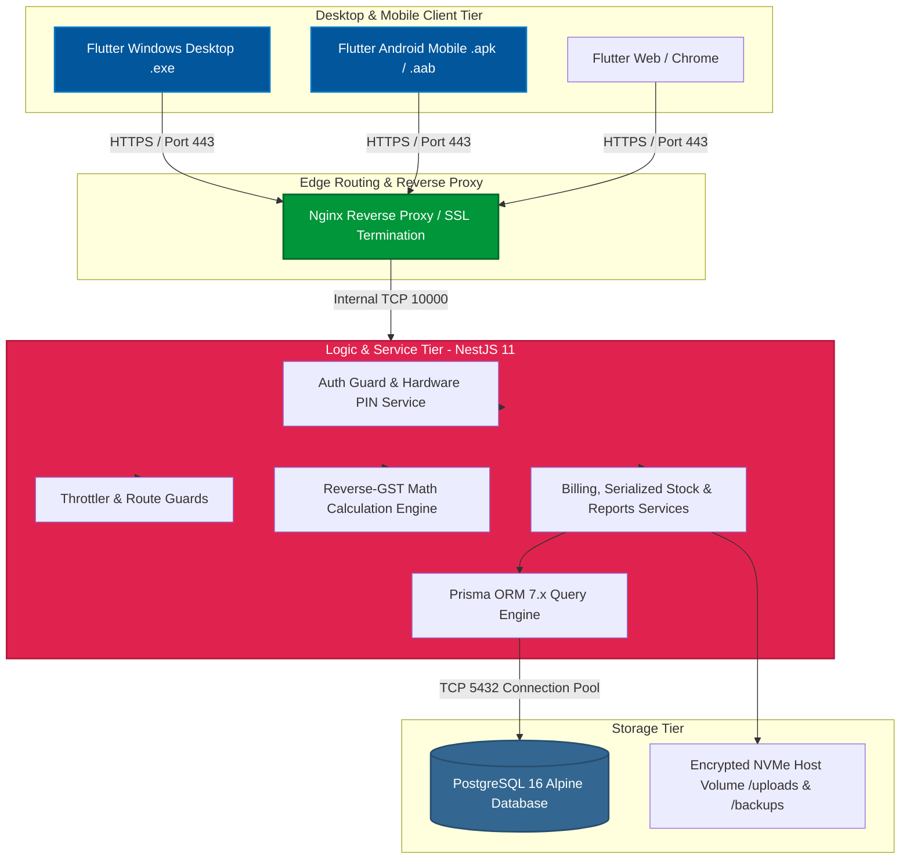

# Syantrex ERP — Enterprise Multi-Tenant Retail & Mobile Shop Management System

**Syantrex ERP** is an enterprise-grade, multi-tenant Point of Sale (POS) and Enterprise Resource Planning (ERP) platform developed and owned by **Syantrex Technologies**[cite: 2, 8, 12]. Built specifically for retail mobile handset showrooms, consumer electronics, and appliance businesses[cite: 1, 10, 12], it bridges desktop counter billing operations and mobile store management through a **Flutter multi-platform client** (Android APK/AAB and Windows Desktop `.exe`) communicating with a **NestJS, Prisma ORM, and PostgreSQL 16 backend**[cite: 1, 6, 10, 12].

---

## 🏛️ System Architecture



---

## 📁 Repository Structure

```text
Syantrex_App/
│
├── frontend/                         ← Flutter Cross-Platform Client Application
│   ├── android/                      # Android platform config, Gradle, ProGuard rules
│   ├── windows/                      # Windows desktop C++ platform runner & CMake
│   ├── web/                          # Flutter web platform entry point
│   ├── assets/                       # Static branding images, typography, and SVG icons
│   ├── lib/                          # Dart source code (Feature-First Architecture)
│   │   ├── app/                      # App router (go_router), global lifecycle & providers
│   │   ├── core/                     # Core configs, secure API interceptors, PIN handlers
│   │   │   ├── api/                  # ApiClient with automatic token refresh & retry
│   │   │   ├── config/               # AppConfig (Dynamic multi-cloud base URLs)
│   │   │   ├── services/             # PinService (30s inactivity lock), ReceiptSettings
│   │   │   └── utils/                # Barcode parser, number-to-words, responsive matrix
│   │   ├── features/                 # Modular domain features
│   │   │   ├── auth/                 # Login, OTP verification, PIN unlock screens
│   │   │   ├── billing/              # High-speed POS terminal, split tenders, cart
│   │   │   ├── employees/            # Staff directory, role management, profiles
│   │   │   ├── inventory/            # Unit-level IMEI tracking, batch intake, stock ledger
│   │   │   ├── invoices/             # A4 GST Tax Invoice and thermal PDF receipt engines
│   │   │   ├── reports/              # Sunday-to-Saturday weekly analytics & aging buckets
│   │   │   └── settings/             # Shop profile, GSTIN, legal info, logo uploader
│   │   └── main.dart                 # App initialization & global error boundaries
│   ├── setup.iss                     # Inno Setup Windows installer packaging script
│   ├── test/                         # Unit & widget test suites (100% Passing)
│   └── pubspec.yaml                  # Flutter dependencies & metadata
│
├── backend/                          ← NestJS Enterprise API Server
│   ├── prisma/
│   │   ├── schema.prisma             # Multi-tenant schema, compound indexes & relations
│   │   └── migrations/               # Production SQL DDL migrations
│   ├── src/
│   │   ├── auth/                     # JWT authentication, BCrypt, session guards
│   │   ├── billing/                  # Checkout transactions, reverse-GST calculation engine
│   │   ├── stock/                    # Serialized IMEI & barcode inventory lifecycle
│   │   ├── products/                 # Product catalog, categories, variants, dynamic SKUs
│   │   ├── shop/                     # Tenant settings, disk-safe logo uploads
│   │   ├── attendance/               # Staff check-in/out & shift tracking
│   │   ├── incentives/               # Commission attribution engine
│   │   ├── reports/                  # Sunday-to-Saturday automated business intelligence
│   │   ├── users/                    # RBAC user accounts, hardware device limits
│   │   ├── database/                 # PrismaService pool & lifecycle
│   │   └── main.ts                   # Bootstrap, Helmet, rate limiting, global DTO pipes
│   ├── test/                         # E2E test suites (tenant isolation, concurrency)
│   ├── Dockerfile                    # Multi-stage Alpine container runner
│   ├── .env.example                  # Sanitized production environment template
│   └── package.json                  # Node.js dependencies & scripts
│
├── .github/workflows/
│   ├── deploy-production.yml         # DigitalOcean / Lightsail production deployment
│   ├── deploy-staging.yml            # Render staging CI/CD pipeline
│   └── build-inno-setup.yml          # Automated Windows .exe / portable ZIP compiler
│
├── docker-compose.yml                # Multi-container orchestrator (PostgreSQL 16 + Backend)
├── nginx.conf                        # Reverse proxy, Let's Encrypt SSL & OWASP headers
├── deploy.sh                         # Automated server deployment & zero-downtime migration
├── run_frontend.bat                  # One-click Windows Flutter launcher
├── run_backend.bat                   # One-click Windows NestJS launcher
└── run_all.bat                       # One-click full-stack launcher

```

---

## ⚡ Key Architectural Features

* **0.00 Paisa Reverse-GST Math:** A specialized tax calculation engine designed for MRP-inclusive retail handset sales to eliminate fractional ledger rounding discrepancies on tax filings.


* **Unit-Level IMEI / Serial Lifecycle:** Strict tracking across item states (`AVAILABLE` $\rightarrow$ `RESERVED` $\rightarrow$ `SOLD` or `DEFECTIVE` $\rightarrow$ `RTV`) with zero duplicate serial numbers per tenant.


* **Atomic Concurrency:** PostgreSQL row sequences (`UPDATE shops SET invoice_counter = invoice_counter + 1 ... RETURNING`) prevent duplicate invoice numbering under concurrent cashier checkouts.


* **30-Second Hardware PIN Security:** Access tokens reside in hardware keystores (`FlutterSecureStorage`), while an automatic 30-second inactivity lock secures POS counters without wiping active cart memory.


* **Dual Invoice PDF Engines:** Pixel-perfect A4 GST invoices and 3-inch (80mm/58mm) thermal receipt printing with nested line-item IMEI tags and Rupees-in-words conversion.


* **Split Settlements:** Unified support for Cash, UPI/QR, Cards, and Consumer Finance EMI loans (Bajaj Finserv, TVS Credit, IDFC First Bank).


---

## 🚀 Quick Start — Local Development

### Option A — Run Full Stack (Recommended)

```powershell
# Windows
.\run_all.bat

# macOS / Linux
./run_all.sh chrome

```

### Option B — Run Services Separately

```powershell
# Start Backend
.\run_backend.bat

# Start Frontend (Specify device: chrome, windows, android, macos)
.\run_frontend.bat windows

```

---

## ⚙️ First-Time Setup

### Prerequisites

* **Flutter SDK** (v3.22.x or higher)
* **Node.js** (v20.x or higher)
* **Docker Desktop** (or PostgreSQL 16 installed locally)

### 1. Backend Setup

```bash
cd backend
npm install
cp .env.example .env

# Edit .env with your PostgreSQL credentials and JWT_SECRET
npx prisma generate
npx prisma migrate dev --name init

npm run start:dev

```

Backend API will boot at `http://localhost:10000`.

### 2. Frontend Setup

```bash
cd frontend
flutter pub get
flutter doctor

# Run with environment defines
flutter run -d chrome --dart-define=ENV=development --dart-define=API_BASE_URL=http://localhost:10000

```

---

## 🛠️ Build & Packaging Pipelines

### Windows Desktop Executable (`.exe`)

Windows installers are automatically compiled via GitHub Actions (`.github/workflows/build-inno-setup.yml`):

```bash
# Push release tag to trigger Inno Setup cloud compilation
git tag v1.0.4
git push origin v1.0.4

```

Compiled `SyantrexERP_Setup.exe` and portable ZIP packages are automatically attached to GitHub Releases.

### Local Windows Compilation

```bash
cd frontend
flutter clean && flutter pub get
flutter build windows --release --no-tree-shake-icons --dart-define=ENV=production --dart-define=API_BASE_URL=[https://app.syantrex.online](https://app.syantrex.online)

```

### Android Production Binary (`.apk` / `.aab`)

```bash
cd frontend
flutter build apk --release --dart-define=ENV=production --dart-define=API_BASE_URL=[https://app.syantrex.online](https://app.syantrex.online)
# Output: frontend/build/app/outputs/flutter-apk/app-release.apk

```

---

## 📊 Verification & QA Suite

| Test Suite | Command | Verification Status |
| --- | --- | --- |
| **Backend Unit & E2E** | `cd backend && npm test` | 100% PASS (20/20 suites)

 |
| **Frontend Unit & Widgets** | `cd frontend && flutter test` | 100% PASS (28/28 suites)

 |
| **Dart Static Analysis** | `cd frontend && flutter analyze` | 0 Warnings / 0 Errors

 |
| **Database Concurrency** | `npm run test:e2e concurrency.spec.ts` | 50 Concurrent Clients / 0 Collisions

 |

---

## 🔐 Security & Multi-Tenancy Guarantee

* **Strict Server Scoping:** `shopId` is extracted solely from the validated JWT claims (`req.user.shopId`). Request body or query overrides are stripped and ignored.


* **IDOR Protection:** All single-record queries bind the resource UUID with the active `shopId` (`where: { id, shopId }`).


* **Input Sanitization:** NestJS global `ValidationPipe` enforces `whitelist: true` and `forbidNonWhitelisted: true`.


* **Rate Limiting:** Sliding-window throttler protects `/auth/login` and `/auth/pin/verify` routes.


* **Keystore Storage:** Auth tokens and PINs are stored exclusively using `FlutterSecureStorage` with hardware-backed Keystore / Keychain / DPAPI.


---

## 📄 Licensing & Distribution

Syantrex ERP is proprietary enterprise software owned exclusively by **Syantrex Technologies**, Pune, Maharashtra, India. Distributed under an annual commercial SaaS subscription licensing model. Unauthorized duplication, distribution, or reverse engineering is strictly prohibited.
